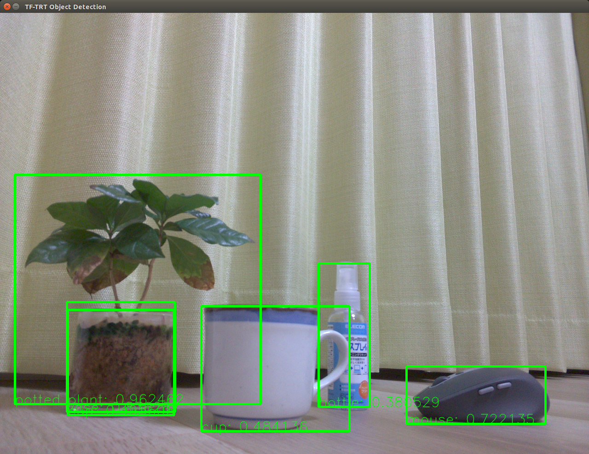

# tf-trt-ssd
Very simple TF-TRT application to detect objects from camera captured image.
This application supports **NVIDIA Jetson Nano Developer Kit** only at this time.

## Prerequisites
1. NVIDIA Jetson Nano Developer Kit and Raspberry Pi Camera V2.
1. Install [NVIDIA-AI-IOT/tf_trt_models](https://github.com/NVIDIA-AI-IOT/tf_trt_models) and run [tf_trt_models/examples/detection/detection.ipynb](https://github.com/NVIDIA-AI-IOT/tf_trt_models/blob/master/examples/detection/detection.ipynb) to have **ssd_inception_v2_coco_trt.pb** which is the deep neural network model for this application. Note that you may need to put Linux swap memory on Jetson Nano for its limited RAM size.
1. Download [coco-labels-paper.txt](https://github.com/amikelive/coco-labels/blob/master/coco-labels-paper.txt) from [amikelive/coco-labels](https://github.com/amikelive/coco-labels).

## Usage
Locate the **tf-trt-ssd.py** script, **ssd_inception_v2_coco_trt.pb** and **coco-labels-paper.txt** to the same directory, and run the script.
~~~
$ python3 tf-trt-ssd.py
~~~
